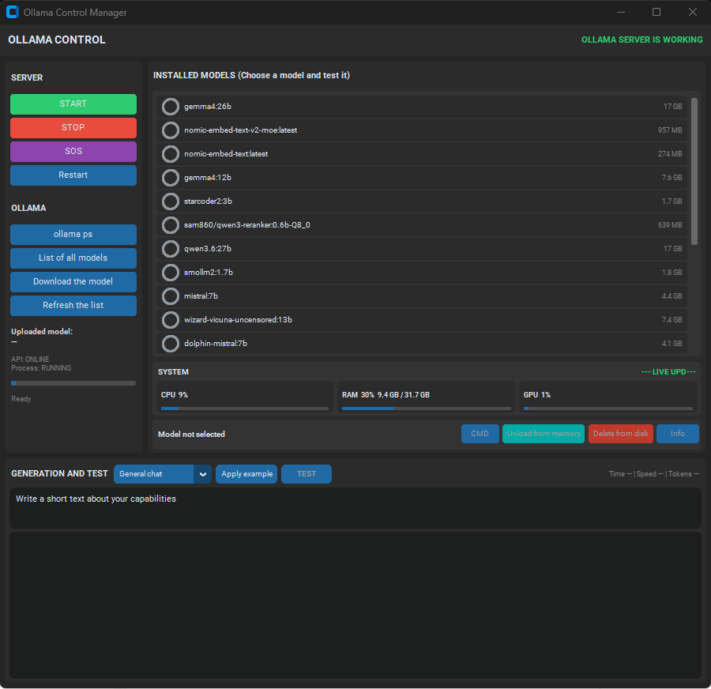

# OlamaStartWin_v1.5.0

A simple manager for managing a local Ollama server on Windows.

## Brief Description

This graphical application (single-file Python script) provides a convenient interface for working with Ollama: starting/stopping the server, viewing and managing models, downloading models, testing generation, and system monitoring (CPU/RAM/GPU).

The program is Windows-based and uses system calls and Windows utilities to assess GPU load and manage processes.

## Requirements

- Windows 10/11
- Python 3.8+
- Ollama (in the PATH or installed in the user's default directory)
- Python dependencies:
- customtkinter
- psutil

You can install dependencies, for example, like this:

pip install customtkinter psutil

## How it works

When launched, the application automatically checks for Ollama availability via the local API (http://127.0.0.1:11434) and the presence of an Ollama process. If Ollama isn't running, you can start the server from the interface (START button). System calls (subprocess, taskkill, etc.) are used to start/stop/force stop.

By default, the application tries to find `ollama` in the PATH; if not, it uses the path:
`%USERPROFILE%\AppData\Local\Programs\Ollama\ollama.exe`.

## Main Features

- Start/stop/restart the Ollama server
- Force stop (taskkill) of all possible Ollama processes
- View a list of installed models (`ollama list`) and those loaded into memory (`ollama ps`)
- Download a model (`ollama pull <model>`) with a progress bar
- Delete a model from disk (`ollama rm <model>`)
- Unload and stop a running model (`ollama stop <model>`)
- Run a selected model in a separate CMD window (`ollama run <model>`)
- Basic model testing: send a prompt to the API /api/generate and display the result with basic statistics (time, tokens, speed)
- System monitor: CPU, RAM, and universal GPU evaluation (via `typeperf`)
- Several prompt templates (rewrite, summarize, review) code, etc.)

## Launch

Run the program:

python OlamaStartWin_v1.5.0.py

The program will open a window with panels: on the left are server controls and operation buttons, on the right are a list of models and a monitor, and at the bottom are a prompt input field and a response area.

## Notes and Limitations

- The application is designed for Windows and uses Windows-specific flags and utilities (e.g., `creationflags=subprocess.CREATE_NO_WINDOW`, `taskkill`, `typeperf`). Errors may occur on Linux/macOS.
- For correct operation, Olama must be installed and have access to its local API.
- The application launches external processes and uses user privileges – please be careful when loading/deleting models.

## Files

- `OlamaStartWin_v1.5.0.py` — main application script
- `OlamaStartWin_v1.5.0.png` — interface screenshot/icon

## License

MIT
